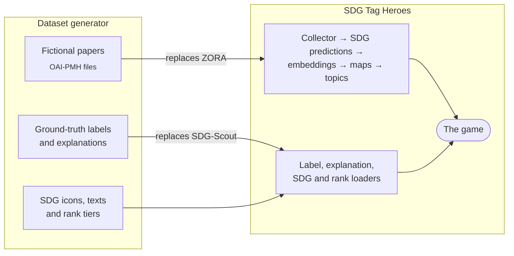

<div align="center">

# SDG Tag Heroes – Dataset Generator

**Fictional scientific publications for [SDG Tag Heroes](https://github.com/HuberNicolas/sdg-tag-heroes), so the game
can be built and played without the original data**


[](LICENSE)

[Quick start](#quick-start) · [Modes](#three-ways-to-write-the-abstracts) · [Output](#output) ·
[Load into SDG Tag Heroes](#load-into-sdg-tag-heroes)

</div>

---

SDG Tag Heroes is a game in which players label scientific publications with the UN Sustainable Development Goals
(SDGs). Its original dataset consists of publications from ZORA, the open repository of the University of Zurich, plus
ground-truth labels and explanations from SDG-Scout. That data cannot be published.

This generator writes **fictional papers in the same formats**. It replaces only the two external sources; SDG Tag
Heroes' own pipeline does everything else, exactly as with the real data:



> [!NOTE]
> Everything in the output is made up: titles, abstracts, authors, faculties, institutes and journals. The papers
> never name real people, institutions, datasets or journals.

## Contents

- [Quick start](#quick-start)
- [Three ways to write the abstracts](#three-ways-to-write-the-abstracts)
- [Options](#options)
- [Output](#output)
- [How the dataset is built](#how-the-dataset-is-built)
- [Load into SDG Tag Heroes](#load-into-sdg-tag-heroes)
- [Development](#development)
- [About the data](#about-the-data)
- [License](#license)

## Quick start

Requires Python 3.10 or newer and [uv](https://docs.astral.sh/uv/).

```bash
git clone https://github.com/HuberNicolas/sdg-tag-heroes-dataset-generator.git
```

```bash
cd sdg-tag-heroes-dataset-generator
```

```bash
uv sync
```

```bash
uv run sdg-dummy-data --count 600 --out output
```

This writes 600 publications with template abstracts to `output/` in a few seconds. Continue with
[Load into SDG Tag Heroes](#load-into-sdg-tag-heroes).

## Three ways to write the abstracts

| `--mode`   | Written by                                         | Cost | Abstracts                     | Time for 600 papers   |
|------------|----------------------------------------------------|------|-------------------------------|-----------------------|
| `template` | Sentence templates (default)                       | free | Formulaic, share many phrases | seconds               |
| `ollama`   | A local model through [Ollama](https://ollama.com) | free | Realistic, 60–110 words       | hours on a laptop CPU |
| `llm`      | Claude, through the Anthropic API                  | paid | Realistic, 150–220 words      | not measured yet      |

The abstracts decide how varied the topics on the game's maps are: with template abstracts, BERTopic finds only a few
topics. Everything else (organisation, labels, explanations) is the same in all modes.

Every written paper is cached in `output/cache/papers-<mode>.jsonl`. If a run stops, the next run only writes the
missing papers.

### Local model (free)

1. Install [Ollama](https://ollama.com/download) and start it.
2. Pull a model:

   ```bash
   ollama pull llama3.2
   ```

3. Generate:

   ```bash
   uv run sdg-dummy-data --count 600 --out output --mode ollama
   ```

   For another model, add `--model <name>`, e.g. `--model qwen2.5:7b`.

Local generation is slow on a CPU. With `deepseek-r1:8b` on an Intel MacBook, one paper took about 35 seconds, so 600
papers take about 6 hours; smaller models such as `llama3.2` (3B) are faster. The run shows the remaining time and can
be stopped and resumed at any time. For a quick try, use a smaller `--count`, e.g. 200.

### Claude (paid)

```bash
uv sync --extra llm
```

```bash
uv run sdg-dummy-data --count 600 --out output --mode llm
```

This needs Anthropic credentials (`ANTHROPIC_API_KEY`, or a profile from `ant auth login`) and costs money: roughly 60
requests for 600 papers.

## Options

| Option          | Default                                    | Meaning                                                   |
|-----------------|--------------------------------------------|-----------------------------------------------------------|
| `--count`       | `600`                                      | Number of publications                                    |
| `--out`         | `output`                                   | Output folder                                             |
| `--mode`        | `template`                                 | `template`, `ollama` or `llm`                             |
| `--model`       | `llama3.2` / `claude-opus-5`               | Model for `--mode ollama` / `--mode llm`                  |
| `--ollama-host` | `$OLLAMA_HOST` or `http://localhost:11434` | Ollama server                                             |
| `--batch-size`  | `10`                                       | Papers per Claude request (Ollama writes one per request) |
| `--page-size`   | `100`                                      | Records per OAI-PMH page (ZORA uses 100)                  |
| `--seed`        | `31011997`                                 | Random seed; the same seed gives the same dataset         |

## Output

```
output/
├── data/                           # copy this into the data/ folder of SDG Tag Heroes
│   ├── pipeline/oai/               # the synthetic ZORA (OAI-PMH, Dublin Core)
│   │   ├── ListSets.xml            #   faculty > institute > division
│   │   ├── ListRecords.xml         #   first page of publications
│   │   └── page-0002.xml …         #   next pages, linked by <resumptionToken>
│   ├── db/
│   │   ├── sdg_label_summary.txt   # ground truth: the SDG each paper was written about (by OAI identifier)
│   │   └── explanations/           # token-level SDG explanations for the abstracts
│   ├── icons/                      # placeholder SDG icons, sdg_extras.json (SDG texts)
│   └── ranks/sdg_ranks.json        # rank tiers per SDG
├── cache/                          # written titles and abstracts per mode
└── manifest.json                   # parameters and counts
```

## How the dataset is built

- **Topics.** Each paper has a **primary SDG** (its topic and its ground-truth label) and one or two **secondary SDGs**
  it also touches. Primary SDGs are assigned round-robin, so every SDG gets the same number of papers. The abstract
  uses the vocabulary of these SDGs, so an SDG classifier recognises them; it never names the SDGs themselves.
- **Organisation.** A made-up university with 4 faculties, 8 institutes and 16 divisions. Faculties publish mostly on
  matching SDGs, e.g. the Faculty of Medicine on SDG 3.
- **Authors.** Faker names in the ZORA format "Lastname, Firstname".
- **Explanations.** They stand in for the SHAP explanations of SDG-Scout: words of an abstract that belong to an SDG's
  vocabulary get a positive score for that SDG, all others a little noise. They are marked with
  `"xai_method": "synthetic-keyword"`.

## Load into SDG Tag Heroes

1. Copy `output/data/` into the `data/` folder of the SDG Tag Heroes repository.
2. Start its databases and run all steps with one command, from its repository root:

   ```bash
   PYTHONPATH=. python utils/dummy/load_dummy_dataset.py
   ```

The script runs the regular pipeline and loader scripts one after the other. The
[Dummy dataset](https://github.com/HuberNicolas/sdg-tag-heroes#dummy-dataset) section of the SDG Tag Heroes README
describes the Python environment, the Docker commands and how to start the game afterwards.

## Development

The code is in [`src/sdg_dummy_data/`](src/sdg_dummy_data):

| Module                                    | Content                                                    |
|-------------------------------------------|------------------------------------------------------------|
| `cli.py`                                  | Command line, output files, caching                        |
| `plan.py`                                 | Primary and secondary SDGs per paper                       |
| `papers.py`                               | Paper specifications and template abstracts                |
| `ollama.py`, `llm.py`                     | Abstracts from a local model or from Claude                |
| `oai.py`                                  | OAI-PMH `ListSets` and `ListRecords` pages                 |
| `explanations.py`                         | Synthetic token-level explanations                         |
| `sdgs.py`, `organizations.py`, `icons.py` | SDG vocabulary, the fictional university, placeholder icons |

Lint and format with [Ruff](https://docs.astral.sh/ruff/) (configured in `pyproject.toml`):

```bash
uv run ruff check .
```

```bash
uv run ruff format .
```

## About the data

The generated data is fictional. The SDG icons in the output are simple placeholders, not the official UN icons.

## License

Released under the [MIT License](LICENSE). The data you generate is yours to use.

## Author

Nicolas Huber · [nicolas.huber.dev@gmail.com](mailto:nicolas.huber.dev@gmail.com) ·
[GitHub](https://github.com/HuberNicolas)

Built as a companion to [SDG Tag Heroes](https://github.com/HuberNicolas/sdg-tag-heroes), a master's thesis at the
University of Zurich.
